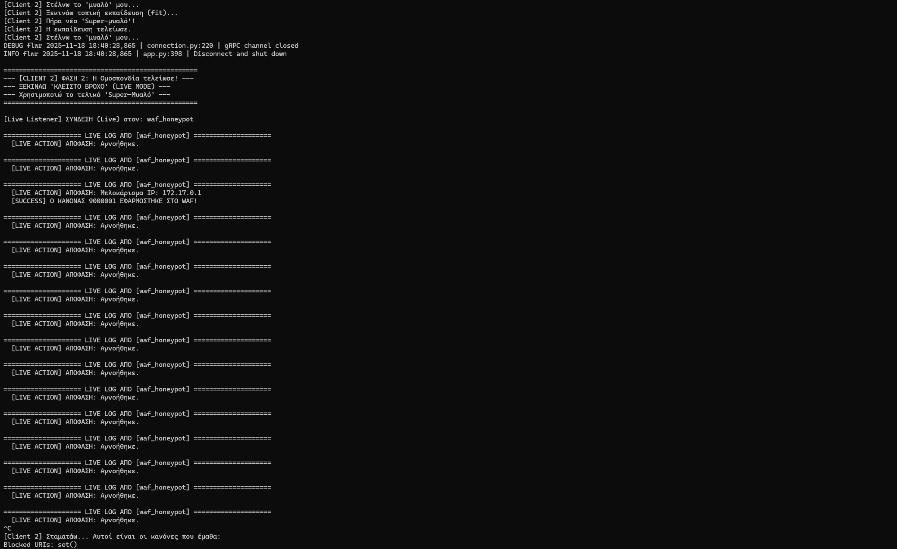
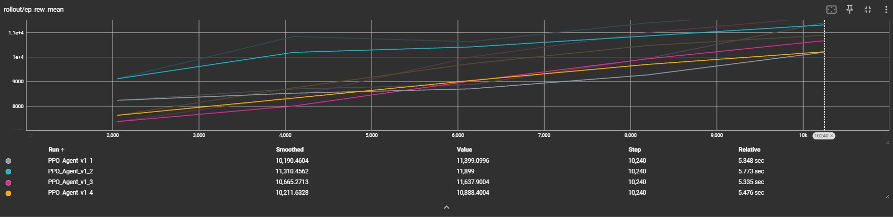

# 🛡️ Federated Reinforcement Learning WAF - DEMO v1.1


## 📖 Overview
This project implements a **Self-Improving Web Application Firewall (WAF)** system using **Federated Reinforcement Learning**.

Unlike traditional WAFs that rely on static signatures, this system employs two autonomous RL Agents that collaborate to:
1.  **Minimize False Positives:** By learning from normal traffic on a Production WAF protecting a DVWA instance.
2.  **Detect Zero-Day Attacks:** By learning from a specialized Web Honeypot.
3.  **Share Knowledge:** Using Federated Learning (Flower) to aggregate insights without sharing raw sensitive logs.
4.  **Close the Loop:** Automatically generating and applying ModSecurity rules (`SecRule`) in real-time upon detecting threats.

## 🏗️ Architecture
The system is fully containerized using **Docker Compose**:

* **Real WAF (Client 1):** Nginx + ModSecurity protecting a vulnerable app (DVWA).
* **Honeypot (Client 2):** Nginx + ModSecurity configured as a trap (High-Interaction).
* **Flower Server:** Aggregates the RL model weights (FedAvg).
* **RL Agent:** Uses `Gymnasium` and `Stable-Baselines3` (PPO) to parse logs and decide actions.

## 📸 Proof of Concept

### 1. Real-Time Defense (Closed Loop)
The Agent detects a Zero-Day attack on the Honeypot and patches the Real WAF instantly.

### 2. Training Performance
The Reinforcement Learning agent maximizing reward over time (Learning to distinguish attacks vs normal traffic).


## 🛠️ How to Run

### Prerequisites
* Docker & Docker Compose
* Python 3.10+

### 1. Start the Infrastructure
Spin up the WAFs, the DVWA, and the Honeypot with one command:
```bash
docker-compose up -d

2. Install Dependencies
pip install -r requirements.txt

3. Run the Federated System
Open 3 terminals:

Terminal 1 (Server):
python3 src/flower_server.py

Terminal 2 (WAF Agent):
python3 src/federated_rl_agent.py 1

Terminal 3 (Honeypot Agent):
python3 src/federated_rl_agent.py 2

👨‍💻 Author
LEMONTZOGLOU CHARALAMBOS

This project was developed as part of my Thesis.
